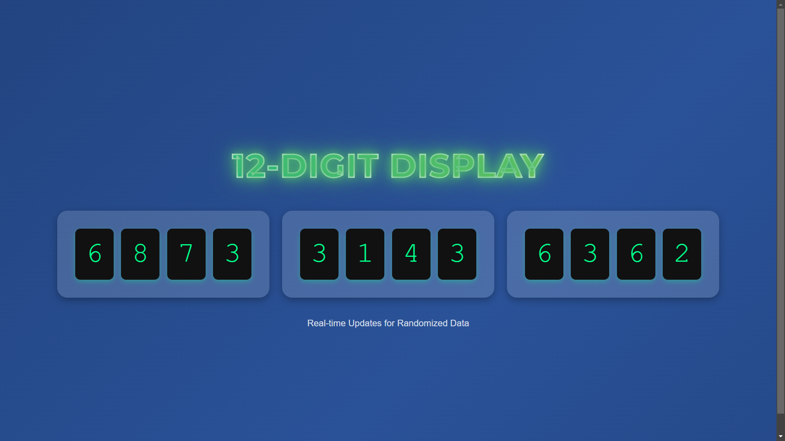
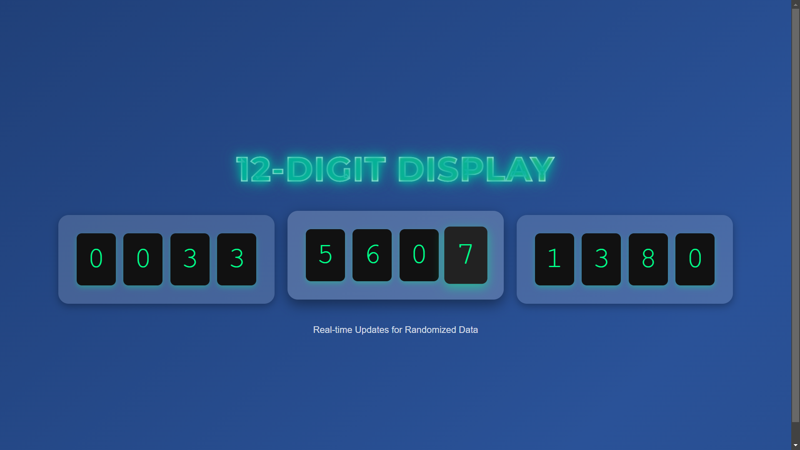
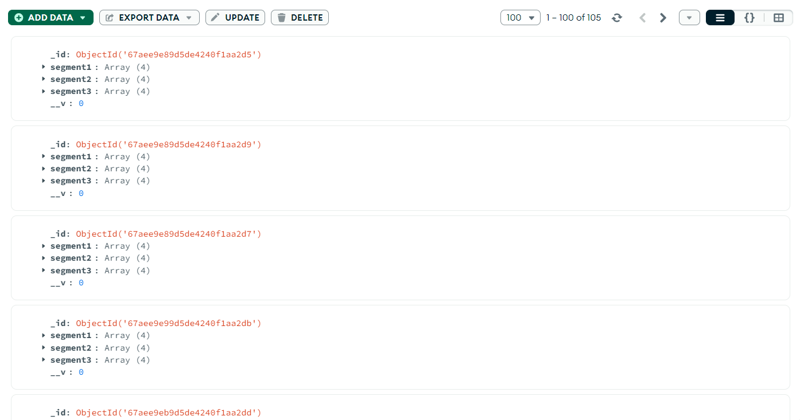
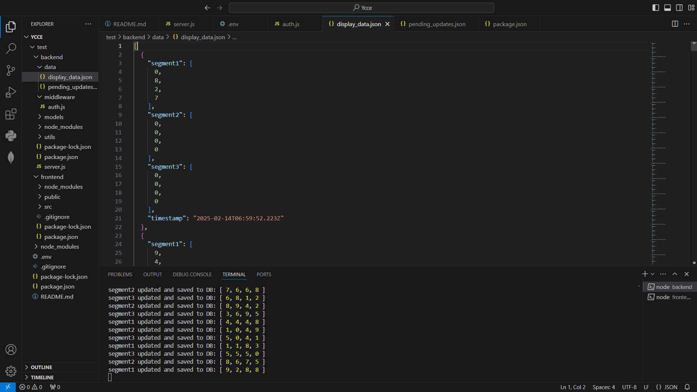

# Live Display Data Transmission System

A web application with a Node.js backend and a React.js frontend. The backend manages data and authentication, while the frontend provides a user-friendly interface.

## Table of Contents

- [Overview](#overview)
- [Installation](#installation)
- [Running the Project](#running-the-project)
- [Directory Structure](#directory-structure)
- [Designs](#designs)
- [Technologies Used](#technologies-used)
- [Contributing](#contributing)
- [License](#license)

---

## Overview

This project is designed to manage and display data with real-time updates. The frontend is built using React, and the backend is developed with Node.js.

This project was made for a hackathon with the following problem statement - 

Hackathon Problem Statement: Live Display Data Transmission System

Problem Overview:

You are given a digital screen with 12 numerical displays arranged in a straight line, grouped into three segments of four digits each. The numbers on these displays change randomly between 0 to 9 at an unpredictable rate. Your task is to build a real-time data capturing and transmission system that records and updates this data on a remote server and a live database continuously.

Requirements:

1.	Display Simulation: Simulate a 12-digit display where each digit randomly changes in real-time.
2.	Real-time Data Capture: Capture each change in live data and store it on a remote server and a live database with minimal latency.
3.	Web/Mobile Dashboard: Create a real-time dashboard to visualize the display changes dynamically.
4.	Efficient Transmission: Implement an optimized data transmission mechanism to avoid excessive network load.
5.	Failure Handling: Ensure data integrity and recovery mechanisms in case of server failure or network disconnection.


---

## Installation

### Prerequisites
- [Node.js](https://nodejs.org/) installed on your system

### Steps
1. Clone the repository:
   ```bash
   git clone https://github.com/Bk2k3/liveDataTransmission
   cd liveDataTransmission

   ```

2. Navigate to the `backend` directory and install dependencies:
   ```bash
   cd backend
   npm install
   ```

3. Navigate to the `frontend` directory and install dependencies:
   ```bash
   cd ../frontend
   npm install
   ```

---

## Running the Project

### Run Frontend
To start the frontend server:
```bash
npm start
```
- The frontend will be accessible at `http://localhost:3000`.

### Run Backend
To start the backend server:
```bash
node server.js
```
- The backend will be accessible at `http://localhost:5000`.

---

## Directory Structure

```
project-root/
│
├── test/
│   ├── backend/
│   │   ├── data/
│   │   │   ├── display_data.json
│   │   │   └── pending_updates.json
│   │   ├── middleware/
│   │   │   └── auth.js
│   │   ├── models/
│   │   │   └── DisplayData.js
│   │   ├── utils/
│   │   │   └── dataUtils.js
│   │   ├── package.json
│   │   └── server.js
│   └── frontend/
│       ├── public/
│       │   ├── favicon.ico
│       │   ├── index.html
│       │   └── other-public-files
│       ├── src/
│       │   ├── App.js
│       │   └── other-src-files
│       ├── package.json
│       └── README.md
```

---

## Designs

### UI Design









---

## Technologies Used

- **Frontend:** React.js
- **Backend:** Node.js, Express.js
- **Middleware:** Auth0 authentication
- **Data Storage:** MongoDB and JSON files Failure handling 

---

## Contributing

Contributions are welcome! Please open an issue or create a pull request.

---
